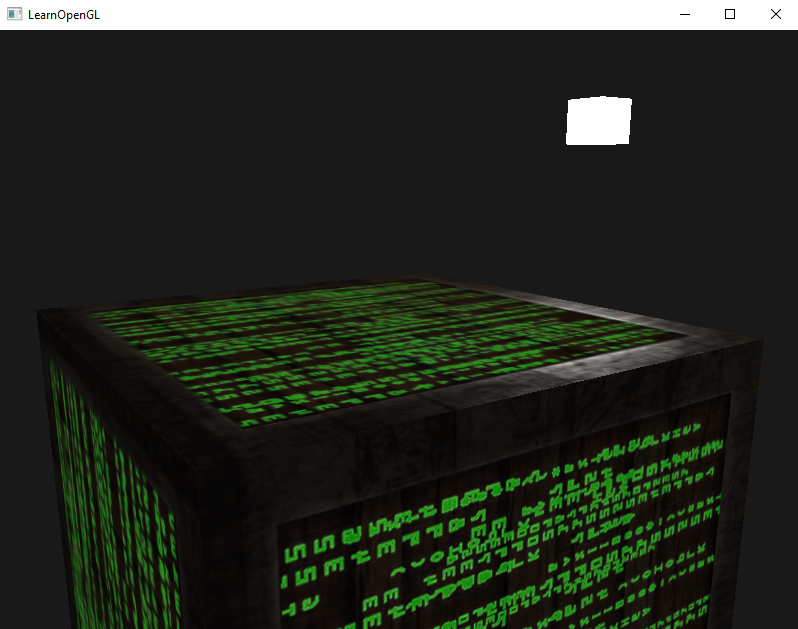
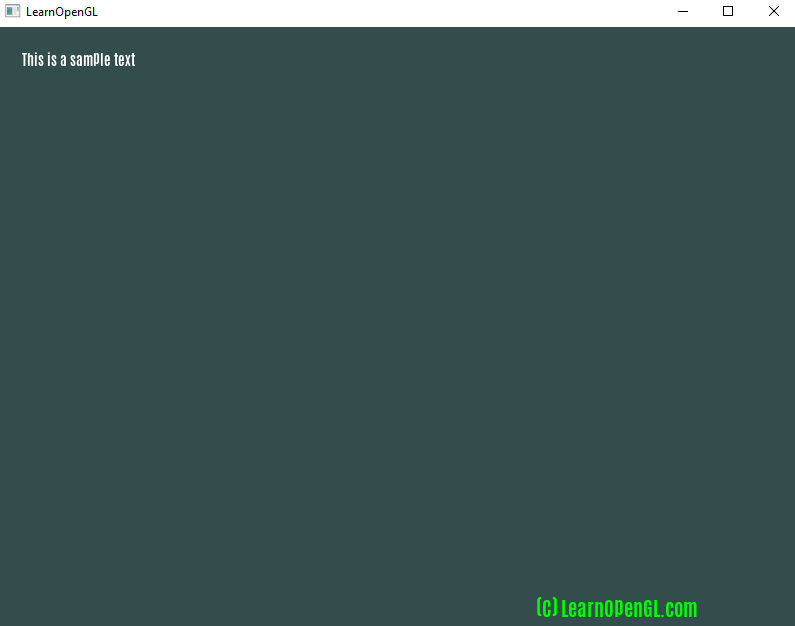
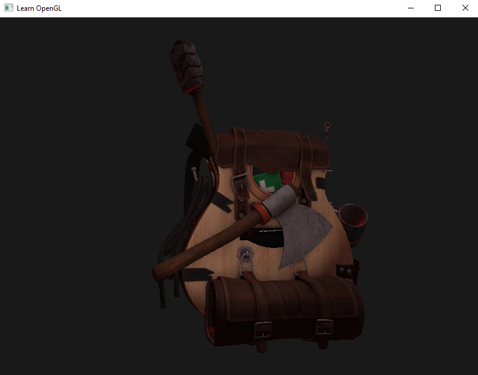

# Learn OpenGL In C, not C++
This code is for those of us who use C instead of C++, for the LearnOpenGL tutorial website.  
  
Original tutorial website here :  
https://learnopengl.com/  

The original github here :  
https://github.com/JoeyDeVries/LearnOpenGL  
  
Their license is the creative common license 4. So I am forced to use that license. 
  
I have converted so far :  
* 1.getting_started 
* 2.lighting 
* 3.model_loading  
* 4.advanced_opengl  
* 7.in_practice
  
**NOTES**  
* Do to the libraries used to get this to work, C99 is the oldest version that you can use. C89 and C90 failed because of those libraries.  
* I tried to stick fairly close to the original author's libraries and folder structures, so that it would be easier to follow along his tutorials.  
* I was finally able to get Assimp working with the help of Nick Wessing's source code. With that I was able to figure out how assimp works. I had never used assimp before. Nick's Github : https://github.com/nwessing/ Also this means I was not using the original shader files that came from LearnOpenGL. However the backpack asset is being used.  Also, the Assimp library supplied here works with codeblocks / mingwx64 ( gcc ). It should work with Visual Studio as well. But I have not tested that.  
  
The code is good enough to learn from, and a lot of the code I hand wrote, to get around the C++ only code.  
  
The C compiler I use is GCC / MinGW 64-Bit. The version I use is from this link :  
https://nuwen.net/mingw.html  
This version works great on windows. Linux users already have access to GCC.  
  
Make sure to look in the libs folder. That is where I kept all of my 3rd party libraries / code from outside sources. The freetype is compiled for codeblocks. So if you need freetype for visual studio or some other compiler / IDE, then you will need to get a fresh copy of freetype and compile it yourself. You can get freetype from here :  
https://freetype.org/
  
  
EXAMPLE Using C  
  
  
  
  
  
  